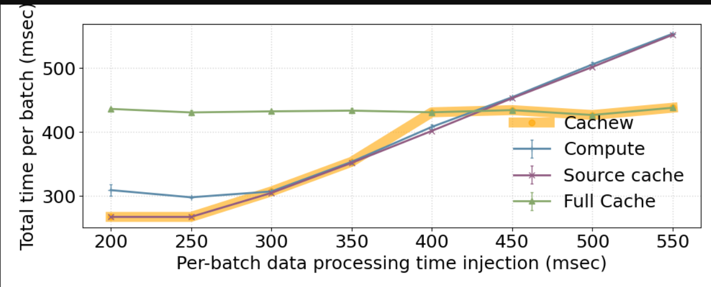

All of the below commands are intended to be executed on the remote VM as deployed via the `deploy_vm.sh` script.
1. **Starting the cluster**. Execute `./manage_cluster.sh start`. The script will create and setup a cluster of several virtual machines.
2. **Checking the status** of the cluster by executing `./manage_cluster.sh status`. If all the status indicators show a green `[OK]`, carry on with the next step.
3. **Running a short test-experiment.** Make sure to use a terminal multiplexer such as `tmux` in case your connection is interrupted. A very short introduction can be found at the end of this readme. Execute `./experiment_fig7.sh -s` to run a short version of the experiment. Check the plot at `time_per_row_highlight.png`, it should have five data points.
4. **Run the full experiment.** Again, make sure to use a terminal multiplexer like `tmux`. Run the experiment using `./experiment_fig7.sh`. The plot will be created at `time_per_row_highlight.png`. You may retrieve the plot using the following command: `gcloud compute scp NAME:cachew_experiments/experiments/autocaching/time_per_row_highlight.png . --zone=us-central1-a --project=cachew-artifact-eval`. Please make sure to replace `NAME` with your remote VMs name.
5. **Tear down the cluster**. Please make sure to execute `./manage_cluster.sh stop` to tear down the cluster.

*How to use `tmux`*: Execute `tmux` in the current directory. Then whatever command you want to execute in the background (i.e. `./experiment_fig7.sh`). You may now close this window by actually closing the terminal itself, **do not use `Ctrl+C` / `Ctrl+D`**. If at a later point you would like to check in on the experiment, ssh into your machine and execute `tmux attach -t 0` (tmux supports multiple of those "background sessions", so if you have multiple open sessions, you may be looking for an integer larger than `0`). In general you may want to interact with `tmux` using [keyboard shortcuts](https://gist.github.com/MohamedAlaa/2961058).

### Reference Result

Below we offer a reference result:

Keep in mind that epoch times might vary due to cloud conditions. The shape of the curves in your plot should still be the same, and a spike is expected in the compute curve on the lower end of the x-axis. Note that the points on the curves, and Cachew's decisions are recorded separately (i.e. in different runs). Consequently, conditions might change, and metrics could potentially vary leading Cachew to make a seemingly 'wrong' decision at points where the three options have similar throughput (this is also visible in this plot at 400ms on the x-axis). Otherwise, Cachew decision expected to follow lowest batch time option.