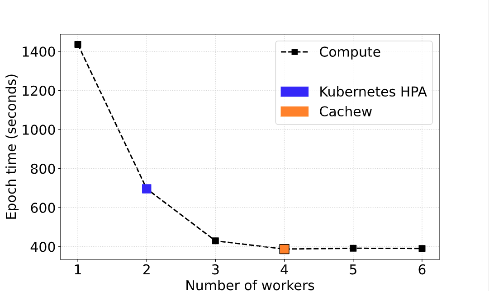

All of the below commands are intended to be executed on the remote VM as deployed via the `deploy_vm.sh` script.
1. **Starting the cluster**. Execute `./manage_cluster.sh start` in the `manage_cluster` subfolder. The script will create and setup a cluster of several virtual machines.
2. **Checking the status** of the cluster by executing `./manage_cluster.sh status` in the `manage_cluster` subfolder. If all the status indicators show a green `[OK]`, carry on with the next step.
3. **Executing the experiment.** Make sure to use a terminal multiplexer (like `tmux`) in case your connection is interrupted. You may find a very short introduction of the minimum set of commands you need to use `tmux` at the end of the readme. Execute `./run_figure_6a_experiment.sh` from the `wait_time` subfolder.
4. **Retrieve the results.** The script will generate the plot at `wait_time/resnet_epochTime_vs_numWorkers_cachew_k8s_atc.pdf` (the following command retrieves the plot, please replace NAME with the your remote VMs name `gcloud compute scp NAME:cachew_experiments/experiments/autoscaling/wait_time/resnet_epochTime_vs_numWorkers_cachew_k8s_atc.pdf . --zone=us-central1-a --project=cachew-artifact-eval`)
5. **Tear down the cluster**. Please make sure to execute `./manage_cluster.sh stop` in the `manage_cluster` subfolder to tear down the cluster.

*How to use `tmux`*: Execute `tmux` in the current directory. Then whatever command you want to execute in the background (i.e. `./run_figure_6a_experiment.sh`). You may now close this window by actually closing the terminal itself, **do not use `Ctrl+C` / `Ctrl+D`**. If at a later point you would like to check in on the experiment, ssh into your machine and execute `tmux attach -t 0` (tmux supports multiple of those "background sessions", so if you have multiple open sessions, you may be looking for an integer larger than `0`). In general you may want to interact with `tmux` using [keyboard shortcuts](https://gist.github.com/MohamedAlaa/2961058).

### Reference Result and Variability

This experiment runs ResNet50 model training on ImageNet while sweeping the number of input data workers. We compare the worker scaling decision of Cachew and the Kubernetes Horizontal Pod Autoscaler baseline. This experiment reproduces Figure 6a in the paper. Since this experiment is expensive to run in the cloud, by default our scripts only reproduce the compute mode curve in Figure 6a.

Keep in mind that epoch time can vary depending on cloud conditions. Decay may or may not be more or less aggressive due to this. Consequently, the Autoscale decision might vary around 4 workers (expected at most ±1 worker). While it is rare, it can happen that the Kubernetes HPA scaling also changes from one worker to two (see 2nd reference image). 

Below we offer two reference results:

