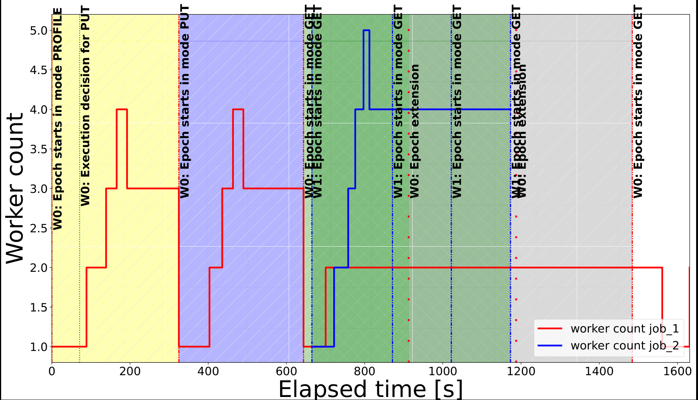

All of the below commands are intended to be executed on the remote VM as deployed via the `deploy_vm.sh` script.
1. **Starting the cluster**. Execute `./manage_cluster.sh start -k 10 -w 10 -g 5` in the `manage_cluster` subfolder. The script will create and setup a cluster of several virtual machines.
2. **Checking the status** of the cluster by executing `./manage_cluster.sh status` in the `manage_cluster` subfolder. If all the status indicators show a green `[OK]`, carry on with the next step.
3. **Executing the experiment.** Make sure to use a terminal multiplexer (like `tmux`) in case your connection is interrupted. You may find a very short introduction of the minimum set of commands you need to use `tmux` at the end of the readme. Execute `./run_figure_10_experiment.sh` from within the `experiment_script` subfolder.
4. **Retrieve the results.** The script will generate the plot at `multi-tenancy/experiment_script/traces_multi_tenant_XXXX/multi_tenant_plot.pdf`.
5. **Tear down the cluster**. Please make sure to execute `./manage_cluster.sh stop` in the `manage_cluster` subfolder to tear down the cluster.

*How to use `tmux`*: Execute `tmux` in the current directory. Then whatever command you want to execute in the background (i.e. `./run_figure_6a_experiment.sh`). You may now close this window by actually closing the terminal itself, **do not use `Ctrl+C` / `Ctrl+D`**. If at a later point you would like to check in on the experiment, ssh into your machine and execute `tmux attach -t 0` (tmux supports multiple of those "background sessions", so if you have multiple open sessions, you may be looking for an integer larger than `0`). In general you may want to interact with `tmux` using [keyboard shortcuts](https://gist.github.com/MohamedAlaa/2961058).

### Reference Result

Below we offer a reference result:

Job 1's first two epochs are not always expected to converge during Autoscale phase (as Cachew prefers to move to next epoch in those compute modes), but it could happen at 3 workers (both epochs). Job 1's third epoch expected to converge around 2 workers. Job 2 is expected to converge around 4 workers. Epoch times for Job 1 should be around [366s, 363s, 266s, 253s] while for Job 2 around 158s initially then around 129s in the later epochs. Both jobs can have epoch extensions towards the end of a run. A reasonable amount of variability in the worker count (±1 worker) and epoch times is expected. The expected sequence of execution modes for Job 1 is [PROFILE, PUT, GET] and for Job 2 is only GET. This experiment is expected to be the relatively volatile, and emphasis should be placed on epoch time convergence and the Autocache decisions. Do note that there is a high likelihood of so called 'extended epochs' (see paper for more details) for both jobs when retrieving from cache. This is due to the fact that this experiment is running on half of the ImageNet dataset, and thus will often not converge in one epoch when retrieving from cache. This should not matter in a real workload, since epochs would be longer, and the total count of epochs is much larger.