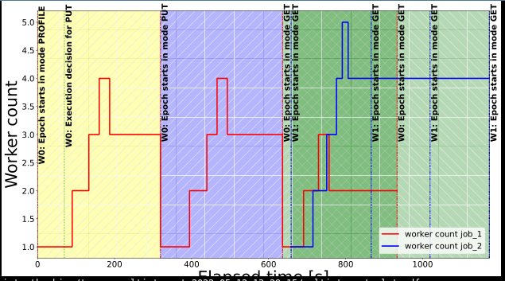

All of the below commands are intended to be executed on the remote VM as deployed via the `deploy_vm.sh` script.
1. **Starting the cluster**. Execute `./manage_cluster.sh start -k 10 -w 10 -g 5` in the `manage_cluster` subfolder. The script will create and setup a cluster of several virtual machines.
2. **Checking the status** of the cluster by executing `./manage_cluster.sh status` in the `manage_cluster` subfolder. If all the status indicators show a green `[OK]`, carry on with the next step.
3. **Executing the experiment.** Make sure to use a terminal multiplexer (like `tmux`) in case your connection is interrupted. You may find a very short introduction of the minimum set of commands you need to use `tmux` at the end of the readme. Execute `./run_figure_10_experiment.sh` from within the `experiment_script` subfolder.
4. **Retrieve the results.** The script will generate the plot at `multi-tenancy/experiment_script/traces_multi_tenant_XXXX/multi_tenant_plot.pdf`.
5. **Tear down the cluster**. Please make sure to execute `./manage_cluster.sh stop` in the `manage_cluster` subfolder to tear down the cluster.

*How to use `tmux`*: Execute `tmux` in the current directory. Then whatever command you want to execute in the background (i.e. `./run_figure_6a_experiment.sh`). You may now close this window by actually closing the terminal itself, **do not use `Ctrl+C` / `Ctrl+D`**. If at a later point you would like to check in on the experiment, ssh into your machine and execute `tmux attach -t 0` (tmux supports multiple of those "background sessions", so if you have multiple open sessions, you may be looking for an integer larger than `0`). In general you may want to interact with `tmux` using [keyboard shortcuts](https://gist.github.com/MohamedAlaa/2961058).

### Reference Result and Variability

This experiment runs two ResNet50 input pipeline jobs. The goal of the experiment is to show that Cachew enables jobs with the same input pipeline to share cached data and the system will scale the number of workers for each job indepedently based on its requirements. In this experiment, the second job's client model ingestion rate is twice as high as the first job's model ingestion rate, hence the second job will be allocated more input data workers. Since the second job's input pipeline is the same as the first job's input pipeline whose result was cached, the second job's input data workers will immediately be able to read data from cache. This experiment reproduces Figure 10 in the paper.

Job 1's first two epochs are not always expected to converge during Autoscale phase (as Cachew prefers to move to next epoch in those compute modes), but it could happen at 3 workers (both epochs). Although rare, it can happen that Autocache converges to the wrong scale in the first couple of epochs for Job 1 due to noise in the metrics. This would not be a problem for long running jobs, where the policy can correct itself, but for these short running jobs it might produce the wrong outcome. Job 1's third epoch is expected to converge around 2 workers. Job 2 is expected to converge around 4 workers. Epoch times for Job 1 should be around [366s, 363s, 266s, 253s] while for Job 2 around 158s initially then around 129s in the later epochs. A reasonable amount of variability in the worker count (±1 worker) and epoch times is expected. The expected sequence of execution modes for Job 1 is [PROFILE, PUT, GET] and for Job 2 is only GET. 

This experiment is expected to be relatively volatile, and emphasis should be placed on epoch time convergence (see epoch times result file) and the Autocache decisions. Autoscale decisions might be more volatile due to the synthetic nature of the job. Do note that there is a high likelihood of so called 'extended epochs' (see paper for more details) for both jobs when retrieving from cache. This is due to the fact that this experiment is running on half of the ImageNet dataset, and will can thus sometimes not converge in one epoch when retrieving from cache. This should not matter in a real workload, since epochs would be longer, and the total count of epochs is much larger. Finally, due to a recent merge with the new 2.8 TF codebase, we have encountered issues at times with the correct identification of cache hits for Job 2 (normally this should only use GET mode, and never enter PROFILE -> PUT -> GET). This bug was introduced by inconsistent use of integer types for dataset fingerprints in TensorFlow (the codebase intermixes the use of `int64` with `uint64`) which affects our cache store when fingerprints are negative in signed form. We hope that we have fixed the bug. We ask the evaluators to re-run this experiment in case the results are not exactly as expected.

Below we offer two reference results:

